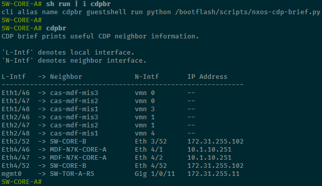

# Network Code

Miscellaneous code primarily used in my role as a network engineer.

# Python Scripts

## `nxos-cdp-brief.py`

`nxos-cdp-brief.py` is a script to run *on* an NX-OS device to print a custom CDP neighbor brief table.

I wanted a way to print a _CDP brief_ while working on NXOS switches, to include each neighbor's **Local interface** along with the **Neighbor hostname**, **interface**, **IP address** (mgmt preferred), and optionally their **platform** and/or **version**.

The script _will_ account for interfaces with multiple neighbors; this is useful when a downstream switch might transparently pass CDP information from subsequent switches, or when ESXi vSwitches are passing CDP info for guest VMs.

The script will attempt to import and use the `natsort` module to naturally sort the neighbors by interface, in ascending order. If `natsort` is not available, the results will still be sorted lexicographically (see the [`natsort` PyPI page](https://pypi.org/project/natsort/) for elaboration).

One line is printed per CDP neighbor, containing the following information (reference the screenshot below);

_*(Optionally), use the args `-p` or `-v` to print the CDP table **with** platform or version information, respectively. There may be some regex parsing issues, has only been validated against most Cisco equipment and some ESXi builds._

| Abbreviation      | Definition                                                                                      |
| ----------------- | ----------------------------------------------------------------------------------------------- |
| `L-Intf`          | _Local_ interface, where the neighbor was discovered.                                           |
| `Neighbor`        | The neighbor's hostname.                                                                        |
| `N-Intf`          | The neighbor's interface that connects to _ours_.                                               |
| `Mgmt-IPv4-Addr`  | The neighbor's Mgmt IPv4 address.                                                               |
| `IPv4-Addr`       | The neighbor's _highest_ valued IP address, only shown if this differs from the Mgmt-IPv4-Addr. |
| (`Platform`) `-p` | The neighbor's platform, or model, information.                                                 |
| (`Version`) `-v`  | The neighbor's software/firmware version.                                                       |

### Usage

1. Enable guestshell on the NX-OS device (optional).
2. Install the natsort python module via guestshell (optional);
   - `sudo chvrf management pip install natsort`
3. Copy this script to bootflash:/scripts/nxos-cdp-brief.py
4. Create a command alias on NX-OS CLI;
   - With guestshell: `cli alias name cdpbr guestshell run python /bootflash/scripts/nxos-cdp-brief.py`
   - Without guestshell: `cli alias name cdpbr python /bootflash/scripts/nxos-cdp-brief.py`
5. Type `cdpbr` in NX-OS CLI to output a useful CDP brief table.